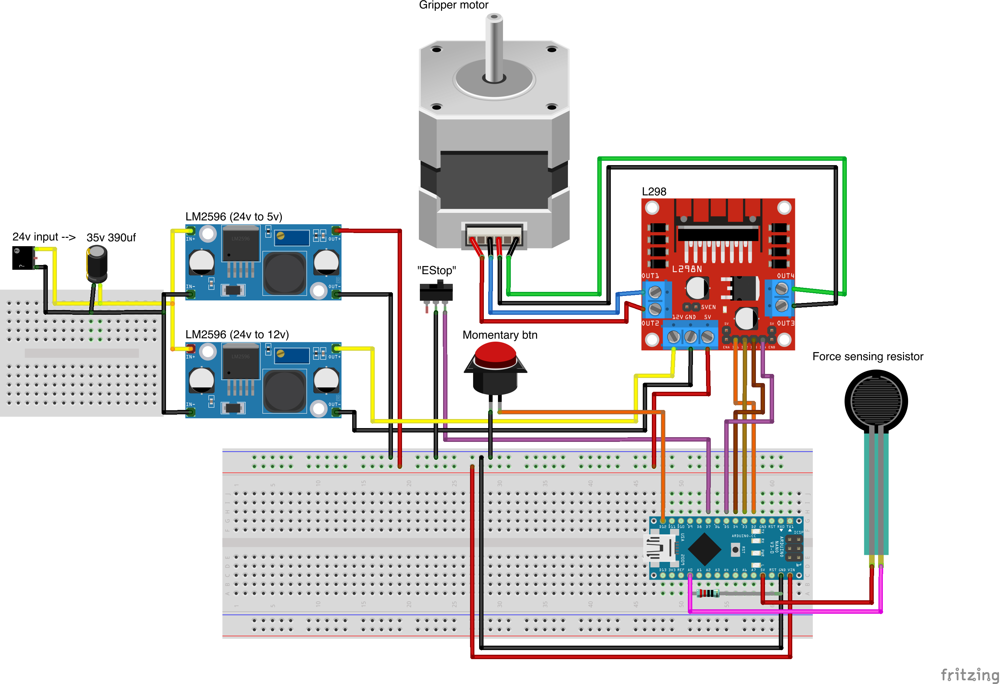

# Nano-L298N-gripper-driver
Simple Arduino Nano, L298N stepper driver, force pressure sensor, end stop test code.

This schematic and code consists gripper with grip pressure sensing and on start calibration via end stop. 
Physical button to toggle gripper close / open. Code is fully working so is hardware.

Relates to this project [nx100-remote-control](https://github.com/norkator/nx100-remote-control).

Table of contents
=================
* [How it works](#how-it-works)
* [Tweaks](#tweaks)
* [L298N](#L298N)
    * [Microstepping options](#microstepping-options)
* [Schematic](#schematic)
    * [Arduino code](#arduino-code)
    * [Sketch](#sketch)
    

How it works
============
1. Power on.
2. Homing procedure -> fully close till hit end stop -> Open fully.
3. Wait for close / open momentary switch presses.

Logic uses both force sensing resistor and end stop to detect points to stop.


Tweaks
============
Following params you most likely need to tweak:
```
const int stepsPerRevolution = 200;
const int stepperMotorSpeed = 150;
const int gripperStepsFullyOpen = -1700;
int gripPressureLimit = 800;
```


L298N
============
With this gripper, idea is to use L298N stepper driver.


Schematic
============
Below image, one resistor between ground and A0 pin is 10k ohm. 



Arduino code
-------
Currently no special notes.
