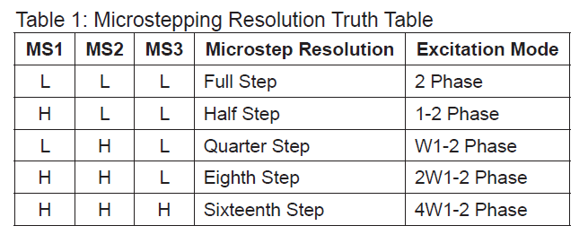

# [WIP] Nano-4988-gripper-driver
Arduino Nano, 4988 stepper driver, film pressure sensor, endstop test code.

Goal is to create gripper with grip pressure sensing and on start calibration via end stop. 
Physical button to toggle gripper close|open.


Table of contents
=================
* [A4988](#A4988)
    * [Microstepping options](#microstepping-options)
* [Schematic](#schematic)
    * [Arduino code](#arduino-code)
    * [Sketch](#sketch)
    


A4988
============
With this gripper, idea is to use a4988 stepper driver.


Microstepping options
-------

```
H = High
L = Low
```




Schematic
============
...


Arduino code
-------
...


Sketch
-------
...